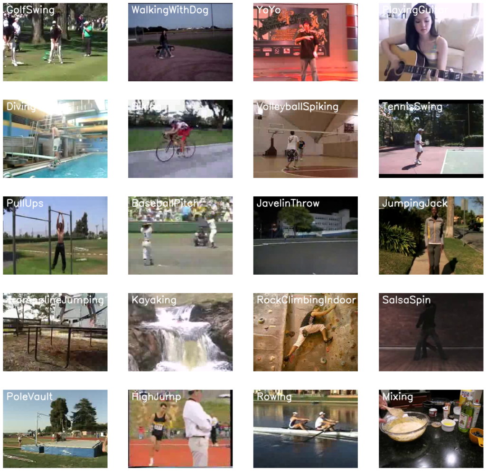

# Action Recognition using CNN and LSTM

## Overview

This guide demonstrates how to combine Convolutional Neural Networks (CNNs) and Long-Short Term Memory (LSTM) networks to perform human action recognition on videos. By leveraging the strengths of both CNNs and LSTMs, we can effectively tackle complex computer vision problems such as video classification. We will explore two different architectures and approaches using TensorFlow, and ultimately use the best-performing model to make predictions on YouTube videos.

## Table of Contents

1. Introduction
2. Understanding Video Classification
    - Image Classification
    - What are Videos?
3. Approaches to Video Classification
    - Approach 1: Single-Frame Classification
    - Approach 2: Late Fusion
4. Convolutional Neural Network (CNN)
5. Further Approaches to Video Classification
    - Approach 3: Early Fusion
    - Approach 4: Using 3D CNNs (Slow Fusion)
    - Approach 5: Using Pose Detection and LSTM
6. Long Short Term Memory (LSTM)
7. Implementing CNN + LSTM for Action Recognition
8. Running Predictions on YouTube Videos

## Introduction

Convolutional Neural Networks are highly effective for image data, while Long-Short Term Memory networks excel with sequence data. By combining CNNs and LSTMs, we can create powerful models for video classification tasks. This document covers the theory behind video classification and demonstrates the implementation of human action recognition on video data using TensorFlow.

## Understanding Video Classification

### Image Classification

Image classification involves passing an image to a classifier, such as a trained Deep Neural Network (CNN or MLP) or a classical classifier, to get class predictions.

### What are Videos?

A video is essentially a sequence of still images (frames) displayed in rapid succession to create the illusion of motion. For example, a .gif of a cat jumping on a bookshelf is a series of 15 frames shown in sequence.

## Approaches to Video Classification

### Approach 1: Single-Frame Classification

The simplest method involves using an image classifier on each frame of the video independently. This approach can miss the temporal relationships between frames, leading to inaccurate predictions.

### Approach 2: Late Fusion

Late fusion involves classifying each frame independently and then merging the classification results in a fusion layer at the end. This method leverages temporal information better than single-frame classification but is still limited.

## Convolutional Neural Network (CNN)

A CNN is a type of deep neural network designed for image data. It uses kernels (filters) to generate feature maps that detect specific features in the image. Each layer of a CNN learns increasingly complex features, from edges and corners in the initial layers to more abstract concepts like human postures in the deeper layers.

## Further Approaches to Video Classification

### Approach 3: Early Fusion

Early fusion merges all information at the beginning of the network. While powerful, it has its limitations.

### Approach 4: Using 3D CNNs (Slow Fusion)

3D CNNs merge spatial and temporal information throughout the network, known as slow fusion. This method is computationally expensive and slow.

### Approach 5: Using Pose Detection and LSTM

This approach involves using a pose detection network to extract landmark coordinates from video frames and then feeding these landmarks into an LSTM network. While effective, it discards other valuable information such as environmental context.

## Long Short Term Memory (LSTM)

LSTM networks are a type of recurrent neural network designed to handle sequence data. They address the vanishing gradient problem of traditional RNNs, allowing them to remember context over long sequences. This makes LSTMs suitable for tasks involving sequential data like time series prediction, speech recognition, and, in our case, action recognition in videos.

## Implementing CNN + LSTM for Action Recognition

We will implement a CNN to extract spatial features from video frames and an LSTM to identify temporal relations between these frames. This combined approach leverages the strengths of both CNNs and LSTMs to create a robust action recognition model.

## Running Predictions on YouTube Videos

Finally, we will use our trained model to make predictions on new video data, such as YouTube videos, to demonstrate the effectiveness of our approach.

---

By the end of this guide, you will have a comprehensive understanding of various video classification approaches and the ability to implement a CNN + LSTM model for action recognition. Let's dive in!
